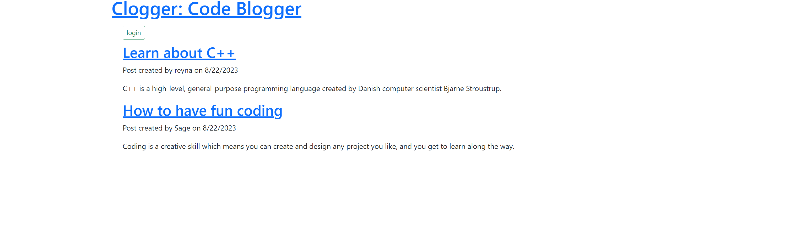

# clogger

## Description

Clogger is a basic CMS-style blog site that allows users to create and delete posts on a variety of coding and programming related topics.

## Table of Contents

- [Technology](#Technology)
- [Installation](#installation)
- [Usage](#usage)
- [Credits](#credits)
- [License](#license)

## Technology

- JavaScript
- Node.js
- Sequalize
- MySql
- Express
- dotenv
- mysql2
- bcrypt
- express-handlebars
- express-session
- connect-session-sequelize

## Installation

No installation is requires as the application is a live website. You can access the live site through the deployment link, here:

https://hidden-fortress-97563-4f2b75cdb15f.herokuapp.com/

## Usage

`When you open the app you are presented with the homescreen and are able to view posts created by other users.`

`Clicking the login button prompts the user to either log in or create an account and sign up.`

`Once the user has logged in, they are redirected to the profile endpoint.`

`From the profile endpoint a user is able to create new posts based on a programming related topic and delete pre-existing posts that they have created.`

`When the user clicks on the header, they are redirected to the homescreen where they can view posts that they and other users have created.`

## License

MIT License

Copyright (c) [2023] [CullenKnott]

Permission is hereby granted, free of charge, to any person obtaining a copy of this software and associated documentation files (the "Software"), to deal in the Software without restriction, including without limitation the rights to use, copy, modify, merge, publish, distribute, sublicense, and/or sell copies of the Software, and to permit persons to whom the Software is furnished to do so, subject to the following conditions:

The above copyright notice and this permission notice shall be included in all copies or substantial portions of the Software.

